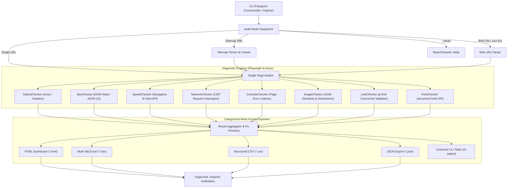

# 🛡️ Page Sentinel: Complete Product & Technical Manual

> **Comprehensive Web Health, 404 Finder, SEO Metadata, Page Speed, Asset Diagnostic Auditor & Report Manager**  
> *A unified reference manual for business stakeholders, SEO specialists, product managers, and engineering teams.*

---

## 📑 Table of Contents

1. [Executive Summary (Non-Technical)](#-executive-summary-non-technical)
2. [Business Value & Key Benefits](#-business-value--key-benefits)
3. [Feature-by-Feature Guide](#-feature-by-feature-guide)
   - [1. 404 Finder & Page Status Checker](#1--404-finder--page-status-checker)
   - [2. SEO Metadata & Social Sharing Inspector](#2--seo-metadata--social-sharing-inspector)
   - [3. Page Speed & Core Web Vitals Auditor](#3--page-speed--core-web-vitals-auditor)
   - [4. Image Asset & Accessibility Diagnostic](#4--image-asset--accessibility-diagnostic)
   - [5. Hyperlink & Redirection Chain Tracer](#5--hyperlink--redirection-chain-tracer)
   - [6. Dynamic Network Traffic & API Monitor](#6--dynamic-network-traffic--api-monitor)
   - [7. WebFont & Typography Validator](#7--webfont--typography-validator)
   - [8. JavaScript Console & Runtime Exception Catcher](#8--javascript-console--runtime-exception-catcher)
   - [9. Automated Report Directory Cleaner & Lifecycle Manager](#9--automated-report-directory-cleaner)
4. [Non-Technical User Guide (How to Run & Interpret)](#-non-technical-user-guide)
   - [Using the Interactive Menu](#using-the-interactive-menu)
   - [Bulk Uploading via Excel/CSV](#bulk-uploading-via-excelcsv)
   - [Cleaning & Resetting Report Folders](#cleaning--resetting-report-folders)
   - [Interpreting Scores, Grades & Colors](#interpreting-scores-grades--colors)
5. [Technical Architecture & Deep-Dive](#-technical-architecture--deep-dive)
   - [System Architecture Diagram](#system-architecture-diagram)
   - [Core Engines & Technology Stack](#core-engines--technology-stack)
   - [Performance & Web Vitals Calculation Algorithms](#performance--web-vitals-calculation-algorithms)
   - [SEO Scoring Weight Matrix](#seo-scoring-weight-matrix)
6. [CLI Flags & Automation Guide (CI/CD)](#-cli-flags--automation-guide)
7. [Organized Reports & Output Schema](#-organized-reports--output-schema)
8. [Error Codes & Remediation Catalog](#-error-codes--remediation-catalog)

---

## 🏢 Executive Summary (Non-Technical)

### What is Page Sentinel?
**Page Sentinel** is an automated web quality assurance tool. Just as an automobile undergoes multi-point inspections, Page Sentinel tests any webpage, bulk list of URLs, or entire website sitemap across **8 diagnostic dimensions**:

```
                               ┌────────────────────────────────┐
                               │   PAGE SENTINEL AUDITOR        │
                               └───────────────┬────────────────┘
         ┌──────────────────┬──────────────────┼──────────────────┬──────────────────┐
         ▼                  ▼                  ▼                  ▼                  ▼
   🔍 404 & Status    📈 SEO Meta       ⚡ Page Speed      🖼️ Image Quality   🔗 Broken Links
   Find broken URLs   Rank higher on     Improve loading    Fix missing imgs   Fix bad redirects
   & server crashes   Google search      & responsiveness   & accessibility    & dead hyperlinks
```

### Why Does It Matter?
- **Customer Experience**: Prevents shoppers and visitors from seeing frustrating `404 Not Found` pages or broken images.
- **Search Engine Ranking (SEO)**: Ensures pages have correct titles, descriptions, social preview images, and mobile tags so search engines rank them higher.
- **Conversion & Speed**: Slow pages lose customers. Page Sentinel measures real load speeds and identifies exact bottlenecks.
- **Risk Prevention**: Discovers hidden JavaScript errors and failing API calls before users report them.
- **Clean Workspace**: Integrated report cleaner keeps your workspace organized and frees disk space with one click.

---

## 💼 Business Value & Key Benefits

| Stakeholder | How Page Sentinel Helps | Key Metrics Delivered |
|---|---|---|
| **Marketing & SEO Teams** | Validates title/description lengths, social share cards (OpenGraph/Twitter), heading structure, and Schema markup. | SEO Health Score (0-100%), SERP snippet preview, social share preview. |
| **Product & Business Managers** | Protects conversion funnels by uncovering broken navigation, missing product images, and slow pages. | Page pass/fail rates, latency benchmarks, critical issue counts. |
| **Content Editors & CMS Authors** | Detects missing `alt` text for accessibility compliance (WCAG) and dead links in rich text fields. | Broken asset list with direct fix instructions. |
| **Engineering & QA Teams** | Automated headless browser auditing with multi-tab Excel, CSV, and JSON outputs for CI/CD integration. | Exact error codes, stack traces, network timing breakdowns. |

---

## 🔍 Feature-by-Feature Guide

---

### 1. 🔍 404 Finder & Page Status Checker
- **HTTP Status Code**: Detects `200 OK`, `301/302/307/308 Redirects`, `400 Bad Request`, `401 Unauthorized`, `403 Forbidden`, `404 Not Found`, and `500/502/503 Server Errors`.
- **Redirect Chains**: Traces multi-hop redirects (e.g., `http://` ➔ `https://` ➔ `/new-page`) to eliminate unnecessary latency.
- **Response Latency**: Measures server response time in milliseconds.
- **Saved under**: `reports/404-status/`

---

### 2. 📈 SEO Metadata & Social Sharing Inspector
- **Meta Title & Description**: Measures character lengths against Google truncation limits (30–60 chars title, 70–160 chars description).
- **Heading Hierarchy**: Verifies single `<h1>` tag with logical `<h2>`–`<h6>` subsections.
- **Canonical & Robots**: Validates self-referencing canonical URLs and indexability.
- **OpenGraph & Twitter Cards**: Inspects `og:title`, `og:description`, `og:image`, and `twitter:card`.
- **Structured Data**: Detects Schema.org JSON-LD scripts.
- **Live Google SERP & Social Previews**: Previews search result snippet and social card.
- **Saved under**: `reports/seo-metadata/`

---

### 3. ⚡ Page Speed & Core Web Vitals Auditor
- **TTFB**: Server response speed (Target: `< 400ms`).
- **FCP / LCP**: Initial rendering and main hero banner rendering times.
- **CLS / TBT**: Visual stability score and JavaScript blocking time.
- **Payload Weights**: Asset weights and request counts for JavaScript, CSS, Images, Fonts, APIs, and HTML.
- **Saved under**: `reports/page-speed/`

---

### 4. 🖼️ Image Asset & Accessibility Diagnostic
- **Broken Images**: Identifies 404/500 missing images in ``, `<picture>`, and CSS backgrounds.
- **WCAG Accessibility**: Flags missing `alt="..."` attributes.
- **Distortion**: Detects visual vs natural aspect ratio distortion.
- **Saved under**: `reports/images/`

---

### 5. 🔗 Hyperlink & Redirection Chain Tracer
- **Internal/External Links**: Crawls and validates every `<a href="...">` anchor tag.
- **Protocol Security**: Flags insecure HTTP links on HTTPS pages.
- **Saved under**: `reports/links/`

---

### 6. ⚡ Dynamic Network Traffic & API Monitor
- **XHR/Fetch Interception**: Captures background REST and GraphQL calls.
- **CORS Violations**: Flags failed backend calls and security blocks.
- **Saved under**: `reports/apis/`

---

### 7. 🔤 WebFont & Typography Validator
- **Font Face Declarations**: Inspects `@font-face` CSS definitions and WebFont files (`.woff2`, `.woff`, `.ttf`).
- **Computed Font Loading**: Verifies `document.fonts.check()` state.

---

### 8. ⚠️ JavaScript Console & Runtime Exception Catcher
- **Uncaught Exceptions**: Captures JavaScript runtime errors with exact script line numbers.

---

### 9. 🧹 Automated Report Directory Cleaner
- **One-Click Cleaning**: Quickly cleans old report files (`.html`, `.xlsx`, `.csv`, `.json`) while preserving clean subdirectories.
- **Selective Cleaning**: Clean all categories or target specific folders (`404-status`, `seo-metadata`, `page-speed`, `full-audit`, `images`, `links`, `apis`).
- **Disk Space Recovery**: Reports exact number of files deleted and disk space freed in KB/MB.

---

## 📖 Non-Technical User Guide

### Using the Interactive Menu

1. Run `npm start`:
   ```bash
   npm start
   ```
2. Enter the URL (or type `"clean"` to clear old reports):
   ```text
   ? Enter Webpage URL, Domain, Sitemap XML, or File Path to audit (or type "clean" to clear reports): https://example.com/
   ```
3. Use **Up/Down arrow keys** to choose your audit diagnostic:
   ```text
   ? Select audit diagnostic for https://example.com/:
     1. Only Images — this one page
     2. Only Images — crawl the entire website
     3. Only Hyperlinks / Links — this one page
     4. Only Hyperlinks / Links — crawl the entire website
     5. Only Network / API calls — this one page
     6. Only Network / API calls — crawl the entire website
     7. 404 Finder & Page Status — this one page
     8. 404 Finder & Page Status — crawl the entire website
     9. SEO Metadata Audit — this one page
     10. SEO Metadata Audit — crawl the entire website
     11. SEO Metadata Audit — bulk upload (file / list of URLs)
     12. Page Speed & Performance — this one page
     13. Page Speed & Performance — crawl the entire website
     14. 🌟 All diagnostics — Images + Links + API + Status + SEO + Speed (full audit)
   ❯ 15. 🧹 Clear / Clean reports folder
   ```

---

### Cleaning & Resetting Report Folders

```bash
# Clean all report files across all folders
npm run clean:reports
# or
npm start -- --clean

# Clean only a specific folder
npm start -- --clean status       # Cleans reports/404-status/
npm start -- --clean seo          # Cleans reports/seo-metadata/
npm start -- --clean speed        # Cleans reports/page-speed/
npm start -- --clean full-audit   # Cleans reports/full-audit/
```

---

### Interpreting Scores, Grades & Colors

| Score Range | Grade | Color Code | Status Meaning | Recommended Action |
|---|---|---|---|---|
| **95% – 100%** | `A+` | 🟢 **Green** | **Optimal / Excellent** | Meets all best practices. No immediate action required. |
| **85% – 94%** | `A` | 🟢 **Green** | **Good** | Solid configuration with minor enhancement opportunities. |
| **70% – 84%** | `B` | 🟡 **Yellow** | **Moderate / Warning** | Noticeable gaps (e.g., missing social cards or moderate TTFB). Review fixes. |
| **55% – 69%** | `C` | 🟠 **Orange** | **Needs Improvement** | Multiple SEO or speed bottlenecks. Prioritize optimization. |
| **40% – 54%** | `D` | 🔴 **Red** | **Poor / At Risk** | Critical tags missing or severe load latency. Fix immediately. |
| **Below 40%** | `F` | 🔴 **Red** | **Critical Failure** | Broken pages, 404 errors, or missing metadata. Urgent remediation required. |

---

## 🛠️ Technical Architecture & Deep-Dive

### System Architecture Diagram



---

## 💻 CLI Flags & Automation Guide

```text
Usage: page-sentinel [options] [url]

Arguments:
  url                         Target URL, Domain, Sitemap XML, or File Path to audit

Options:
  -i, --image                 Focus exclusively on image assets (DOM, picture, dimensions, alt text)
  --link                      Focus exclusively on hyperlinks, internal/external links & redirect hops
  --api                       Focus exclusively on dynamic network traffic, XHR, fetch & APIs
  --status, --404             404 Finder & Page HTTP Status checker
  --seo, --meta               SEO Metadata inspector (Title, Description, Canonical, Robots, OG, Schema)
  --speed, --perf             Page Speed & Web Vitals performance auditor
  --bulk <file_or_urls>       Bulk URL list (.txt, .csv, or comma-separated list of URLs)
  --clean [category]          Clean report files from reports directory (all, status, seo, speed, etc.)
  --clear-reports [category]  Alias for --clean
  -s, --sitemap [url]         Audit pages discovered from sitemap.xml
  -a, --all                   Audit all pages in the sitemap without any limit
  -l, --limit <number>        Maximum number of pages to audit (e.g. 10, 20, or "all")
  -t, --timeout <ms>          Navigation timeout in milliseconds (default: "40000")
  --headless <boolean>        Run in headless browser mode (default: "true")
  --no-scroll                 Disable smooth auto-scroll to trigger lazy loading
  -c, --concurrency <number>  Concurrent checking limit (default: "6")
  -o, --output-dir <path>     Directory to save HTML, CSV, Excel, and JSON reports (default: "./reports")
  -h, --help                  Display help for command
```

---

## 📊 Organized Reports & Output Schema

Reports are automatically organized into dedicated subdirectories. **Every folder contains its own dedicated Executive Summary report files (`summary_*.html` and `summary_*.csv`) alongside full granular reports**:

```text
reports/
├── 404-status/     # Page status reports
│   ├── page_status_*.html / *.xlsx / *.csv / *.json   (Detailed Diagnostics)
│   └── summary_page_status_*.html / *.csv             (Executive KPI Summary)
├── seo-metadata/   # SEO metadata & SERP previews
│   ├── seo_report_*.html / *.xlsx / *.csv / *.json    (Detailed Diagnostics)
│   └── summary_seo_report_*.html / *.csv              (Executive KPI Summary)
├── page-speed/     # Core Web Vitals & speed reports
│   ├── page_speed_*.html / *.xlsx / *.csv / *.json    (Detailed Diagnostics)
│   └── summary_page_speed_*.html / *.csv              (Executive KPI Summary)
├── full-audit/     # Unified full diagnostics containing all 8 areas
│   ├── audit_*.html / *.xlsx / *.csv / *.json         (Detailed Diagnostics)
│   └── audit_summary_*.html / *.csv                   (Executive KPI Summary)
├── images/         # Image-specific audit reports & summaries
├── links/          # Link & redirection audit reports & summaries
└── apis/           # Dynamic API traffic audit reports & summaries
```

---

## 🚨 Error Codes & Remediation Catalog

| Category | Error Code | Root Cause | Actionable Remediation Step |
|---|---|---|---|
| **Status** | `HTTP_404_NOT_FOUND` | Page or resource was deleted or moved without redirect. | Verify if URL was relocated. Configure `301 Moved Permanently` redirect in server config. |
| **Status** | `HTTP_500_ERROR` | Uncaught server exception or database connectivity issue. | Inspect backend web application logs and database connection pool. |
| **Status** | `HTTP_REDIRECT` | URL redirects across one or more hops. | Update internal links to point directly to the final destination URL. |
| **SEO** | `MISSING_TITLE` | `<title>` tag is missing from page `<head>`. | Add a unique, keyword-rich `<title>` tag (30–60 characters). |
| **SEO** | `MISSING_DESC` | `<meta name="description">` is missing. | Add a compelling meta description tag (70–160 characters) to improve CTR. |
| **SEO** | `MULTIPLE_H1` | Page contains more than one `<h1>` tag. | Use exactly one primary `<h1>` tag; structure subheadings with `<h2>`–`<h6>`. |
| **SEO** | `NO_OG_IMAGE` | `og:image` meta tag is missing. | Add an OpenGraph preview image (1200x630px) for WhatsApp/LinkedIn/Twitter sharing. |
| **Speed** | `SLOW_TTFB` | Server response latency exceeds 600ms. | Enable edge CDN caching (Cloudflare/Fastly) and database query caching. |
| **Speed** | `HEAVY_JS_BUNDLE` | Total JavaScript payload exceeds 1.5MB. | Implement code-splitting, dynamic imports, minification, and gzip/brotli. |
| **Speed** | `HEAVY_IMAGES` | Total image assets exceed 3.0MB. | Convert graphics to Next-Gen formats (WebP/AVIF) and add `loading="lazy"`. |
| **Image** | `IMG_BROKEN` | `` src returned 404 or failed to load. | Replace broken image file in CMS / Digital Asset Management (DAM). |
| **Image** | `WCAG_ALT_MISSING` | `` tag has no `alt` attribute. | Add descriptive `alt="Description of image"` attribute for accessibility. |
| **Link** | `LINK_BROKEN` | Anchor link targets a non-existent URL. | Update `href` attribute to valid destination or remove dead link. |
| **API** | `NET_REQUEST_FAILED` | Background API / Fetch call failed. | Check API gateway health, endpoint routing, and authentication tokens. |
| **Console** | `JS_RUNTIME_ERROR` | Uncaught JavaScript exception occurred. | Review script error trace, use optional chaining `?.`, and add `try/catch`. |

---

*Page Sentinel is maintained as an enterprise web quality auditor.*
